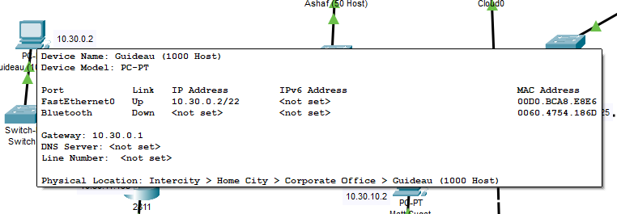
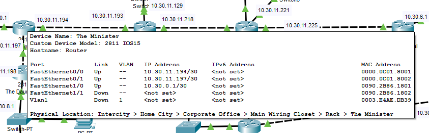
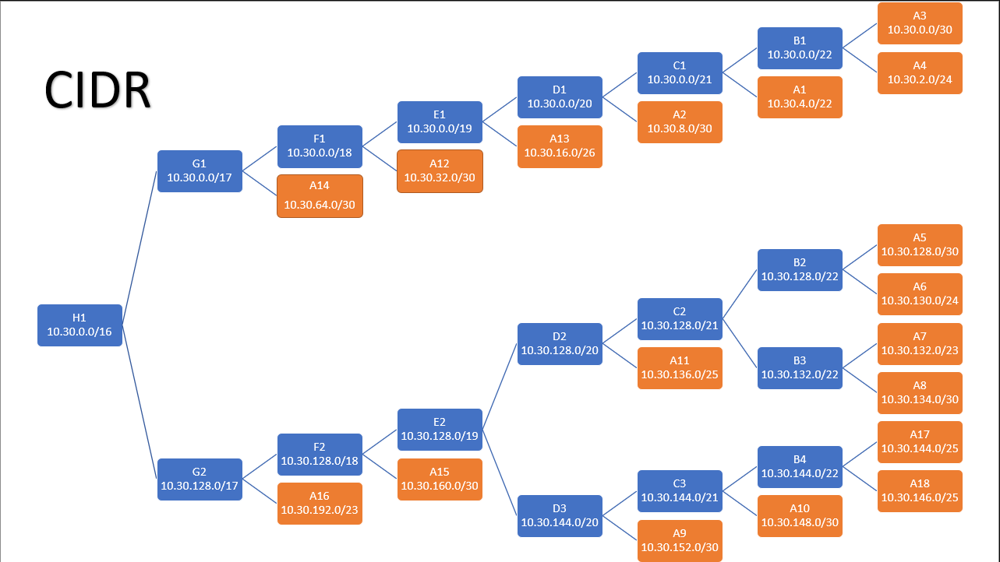

# Jarkom-Modul-4-F03-2022
Praktikum Jaringan Komputer Modul 4 Kelompok F 03 2022

### Kelompok F03

| **No** | **Nama**                   | **NRP**    | **Pembagian Pekerjaan** |
| ------ | -------------------------- | ---------- | ----------------------- |
| 1      | Naufal Fabian Wibowo    | 05111940000223 | Mengerjakan Lapres |
| 2      | Angela Oryza Prabowo          | 5025201022 | Mengerjakan nomor 1-11, Menambahkan Dokumentasi |
| 3      | Helmi Taqiyuddin | 5025201152 | Mengerjakan Lapres |

``` IP Prefix Kelompok F03 = 10.30``` 

# Soal


- Menggunakan metode classless VLSM pada CISCO
- Menggunakan metode classless CIDR pada GNS3

# VLSM dengan Cisco
Pertama-tama, bagi topologi yang sudah diberikan ke dalam beberapa subnet kecil sesuai kebutuhan:


Tentukan jumlah IP yang diperlukan beserta dengan netmasknya untuk setiap subnet yang ada :

|  Subnet   | Jumlah IP | Netmask |
| :-------: | :-------: | :-----: |
|    A1     |   1001    |   /22   |
|    A2     |    501    |   /30   |
|    A3     |   271     |   /30   |
|    A4     |   251     |   /24   |
|    A5     |   212     |   /30   |
|    A6     |    121    |   /24   |
|    A7     |    121    |   /23   |
|    A8     |     71    |   /30   |
|    A9     |     51    |   /30   |
|    A10    |     2     |   /30   |
|    A11    |     2     |   /30   |
|    A12    |     2     |   /30   |
|    A13    |     2     |   /30   |
|    A14    |     2     |   /30   |
|    A15    |     2     |   /30   |
|    A16    |     2     |   /30   |
|    A17    |     2     |   /30   |
|    A18    |     2     |   /30   |
| **Total** | **2618**  | **/20** |

Berdasarkan data tersebut, susun tree subnet VLSM seperti berikut :
.png)

Dengan demikian, didapatkan NID untuk masing - masing subnet sebagai berikut :
|  Subnet   | Network ID| Netmask |
| :-------: | :-------: | :-----: |
|    A1     |10.30.8.0  |   255.255.252.0   |
|    A2     |    10.30.6.0    |   255.255.254.0   |
|    A3     |   10.30.4.0     |   255.255.254.0   |
|    A4     |   10.30.3.0     |   255.255.255.0   |
|    A5     |   10.30.2.0     |   255.255.255.0   |
|    A6     |    10.30.1.128    |   255.255.255.128   |
|    A7     |     10.30.1.0    |   255.255.255.128   |
|    A8     |     10.30.0.128    |   255.255.255.128   |
|    A9     |     10.30.0.64     |   255.255.255.192   |
|    A10    |     10.30.0.32     |   255.255.255.252   |
|    A11    |     10.30.0.28     |   255.255.255.252   |
|    A12    |     10.30.0.24     |   255.255.255.252   |
|    A13    |     10.30.0.20     |   255.255.255.252   |
|    A14    |     10.30.0.16     |   255.255.255.252   |
|    A15    |     10.30.0.12     |   255.255.255.252   |
|    A16    |     10.30.0.8    |   255.255.255.252   |
|    A17    |     10.30.0.4     |   255.255.255.252   |
|    A18    |     10.30.0.0     |   255.255.255.252   |

Masing - masing interface pada sebuah subnet dapat diberikan IP sesuai dengan aturan yang telah diberikan di atas.

- Guideau


- The Minister


- The Dauntless


- Johan


- Phanora


- The Order


- Ashaf


- The Resonance


- The Beast


- The Instrument


- Matt Cugat


- The Firefist


- Keith


- The Queen


- The Witch


- Oakleave


- The Magical


- Corvekt


- Haines


- The Profound


- Spendrow


- Helga


## Routing


# CIDR dengan GNS3

## Topologi pada GNS3

## Subnetting

### Penggabungan subnet


### Pembagian IP

| SUBNET | NID    | NETMASK | Broadcast Address |
| :---:   | :---: | :---: | :---: |
| A1 |  10.30.0.0  |  255.255.252.0  | 10.30.3.255 |
| A2 | 10.30.11.192 | 255.255.255.252 | 10.30.11.195 |
| A3 | 10.30.11.196 | 255.255.255.252 | 10.30.11.199 |
| A4 | 10.30.8.0 | 255.255.255.0 | 10.30.8.255 |
| A5 | 10.30.11.200 | 255.255.255.252 | 10.30.11.203 |
| A6 | 10.30.9.0 | 255.255.255.0 | 10.30.9.255 |
| A7 | 10.30.4.0 | 255.255.254.0 | 10.30.5.255 |
| A8 | 10.30.11.204 | 255.255.255.252 | 10.30.11.207 |
| A9 | 10.30.11.208 | 255.255.255.252 | 10.30.11.211 |
| A10 | 10.30.11.212 | 255.255.255.252 | 10.30.11.215 |
| A11 | 10.30.10.0 | 255.255.255.128 | 10.30.10.127 |
| A12 | 10.30.11.216 | 255.255.255.252 | 10.30.11.219 |
| A13 | 10.30.11.128 | 255.255.255.192 | 10.30.11.191 |
| A14 | 10.30.11.220 | 255.255.255.252 | 10.30.11.223 |
| A15 | 10.30.11.224 | 255.255.255.252 | 10.30.11.227 |
| A16 | 10.30.6.0 | 255.255.254.0 | 10.30.7.255 |
| A17 | 10.30.11.0 | 255.255.255.128 | 10.30.11.127 |
| A18 | 10.30.10.128 | 255.255.255.128 | 10.30.10.255 |

### Konfigurasi

#### ROUTER

> The Resonance

```
# Config for eth0 (NAT)
auto eth0
iface eth0 inet dhcp

# Static config for eth1 (A14)
auto eth1
iface eth1 inet static
	address 10.30.64.1
	netmask 255.255.255.252


# Static config for eth2 (A15)
auto eth2
iface eth2 inet static
	address 10.30.160.1
	netmask 255.255.255.252

# Static config for eth3 (A9)
auto eth3
iface eth3 inet static
	address 10.30.152.1
	netmask 255.255.255.252

# Static config for eth4 (A12)
auto eth4
iface eth4 inet static
	address 10.30.32.1
	netmask 255.255.255.252
```

> The Order

```
# Static config for eth0 (A12)
auto eth0
iface eth0 inet static
	address 10.30.32.2
	netmask 255.255.255.252
	gateway 10.30.32.1

# Static config for eth1 (A13)
auto eth1
iface eth1 inet static
	address 10.30.16.1
	netmask 255.255.255.192

# Static config for eth2 (A2)
auto eth2
iface eth2 inet static
	address 10.30.8.1
	netmask 255.255.255.252
```

> The Minister

```
# Static config for eth0 (A2)
auto eth0
iface eth0 inet static
	address 10.30.8.2
	netmask 255.255.255.252
	gateway 10.30.8.1

# Static config for eth1 (A3)
auto eth1
iface eth1 inet static
	address 10.30.0.1
	netmask 255.255.255.252


# Static config for eth2 (A1)
auto eth2
iface eth2 inet static
	address 10.30.4.1
	netmask 255.255.252.0
```

> The Dauntless

```
# Static config for eth0 (A3)
auto eth0
iface eth0 inet static
	address 10.30.0.2
	netmask 255.255.255.252
	gateway 10.30.0.1

# Static config for eth1 (A4)
auto eth1
iface eth1 inet static
	address 10.30.2.1
	netmask 255.255.255.0
```

> The Magical

```
# Static config for eth0 (A15)
auto eth0
iface eth0 inet static
	address 10.30.160.2
	netmask 255.255.255.252
	gateway 10.30.160.1

# Static config for eth1 (A16)
auto eth1
iface eth1 inet static
	address 10.30.192.1
	netmask 255.255.254.0
```

> The Instrument

```
# Static config for eth0 (A9)
auto eth0
iface eth0 inet static
	address 10.30.152.2
	netmask 255.255.255.252
	gateway 10.30.152.1

# Static config for eth1 (A8)
auto eth1
iface eth1 inet static
	address 10.30.134.1
	netmask 255.255.255.252

# Static config for eth2 (A10)
auto eth2
iface eth2 inet static
	address 10.30.148.1
	netmask 255.255.255.252

# Static config for eth3 (A11)
auto eth3
iface eth3 inet static
	address 10.30.136.1
	netmask 255.255.255.128
```

> The Profound

```
# Static config for eth0 (A10)
auto eth0
iface eth0 inet static
	address 10.30.148.2
	netmask 255.255.255.252
	gateway 10.30.148.1

# Static config for eth1 (A18)
auto eth1
iface eth1 inet static
	address 10.30.146.1
	netmask 255.255.255.128

# Static config for eth2 (A17)
auto eth2
iface eth2 inet static
	address 10.30.144.1
	netmask 255.255.255.128
```

> Teh FireFist

```
# Static config for eth0 (A8)
auto eth0
iface eth0 inet static
	address 10.30.134.2
	netmask 255.255.255.252
	gateway 10.30.134.1

# Static config for eth1 (A6)
auto eth1
iface eth1 inet static
	address 10.30.130.1
	netmask 255.255.255.0

# Static config for eth2 (A7)
auto eth2
iface eth2 inet static
	address 10.30.132.1
	netmask 255.255.254.0
```

> The Queen

```
# Static config for eth0 (A6)
auto eth0
iface eth0 inet static
	address 10.30.130.2
	netmask 255.255.255.0
	gateway 10.30.130.1

# Static config for eth1 (A5)
auto eth1
iface eth1 inet static
	address 10.30.128.1
	netmask 255.255.255.252
```

#### PC

> Ashaf

```
auto eth0
iface eth0 inet static
	address 10.30.16.2
	netmask 255.255.255.192
	gateway 10.30.16.1
```

> Guidae

```
auto eth0
iface eth0 inet static
	address 10.30.4.2
	netmask 255.255.252.0
	gateway 10.30.4.1
```

> Phanora

```
auto eth0
iface eth0 inet static
	address 10.30.2.2
	netmask 255.255.255.0
    gateway 10.30.2.1
```

> Johan

```
auto eth0
iface eth0 inet static
	address 10.30.2.3
	netmask 255.255.255.0
    gateway 10.30.2.1
```

> Corvekt

```
auto eth0
iface eth0 inet static
	address 10.30.192.3
	netmask 255.255.254.0
    gateway 10.30.192.1
```

> Haines

```
auto eth0
iface eth0 inet static
	address 10.30.192.2
	netmask 255.255.254.0
    gateway 10.30.192.1
```

> MattCugat

```
auto eth0
iface eth0 inet static
	address 10.30.136.2
	netmask 255.255.255.128
    gateway 10.30.136.1
```

> Spendrow

```
auto eth0
iface eth0 inet static
	address 10.30.146.2
	netmask 255.255.255.128
    gateway 10.30.146.1
```

> Helga

```
auto eth0
iface eth0 inet static
	address 10.30.144.2
	netmask 255.255.255.128
    gateway 10.30.144.1
```

> Oakleave

```
auto eth0
iface eth0 inet static
	address 10.30.132.2
	netmask 255.255.254.0
    gateway 10.30.132.1
```

> Keith

```
auto eth0
iface eth0 inet static
	address 10.30.130.3
	netmask 255.255.255.0
    gateway 10.30.130.1
```

#### SERVER

> The Beast

```
auto eth0
iface eth0 inet static
	address 10.30.64.2
	netmask 255.255.255.252
    gateway 10.30.64.1
```

> The Witch

```
auto eth0
iface eth0 inet static
	address 10.30.128.2
	netmask 255.255.255.252
    gateway 10.30.128.1
```

## Routing


### The Resonance

```

```

### The Order

```

```

### The Minister

```

```

### The Dauntless

```

```

### The Magical

```

```

### The Instrument

```

```

### The Profound

```

```

### The FireFist

```

```

### The Queen

```
```
